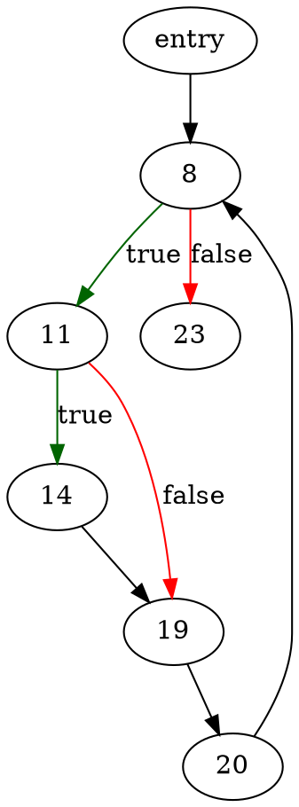

# demo

A short demo of the LLVM IR to Go decompilation pipeline of [decomp](https://github.com/decomp/decomp).

## Dependencies

Install Clang and LLVM.

For Arch Linux:
```bash
pacman -S clang llvm
```

Install tools used by demo.

```bash
go install -v github.com/decomp/exp/cmd/dot2png@master
go install -v github.com/mewkiz/cmd/sar@master
go install -v golang.org/x/tools/cmd/goimports@master
```

(optional) Install the Grind tool used by demo.

**Note**: the official repository of [Grind](https://github.com/rsc/grind) is no longer maintained, thus we rely on a fork.

```bash
git clone https://github.com/mewpull/grind
cd grind
git switch go-importer
go install -v
```

## Installation

Clone the [decomp](https://github.com/decomp/decomp) repository and install the decomp tools.

```bash
git clone https://github.com/decomp/decomp
cd decomp
go install -v ./...
```

## Usage

```bash
cd decomp/examples/demo
make
```

**Note**: A direct translation from C to LLVM IR to Go introduced unused variables (used by Clang to handle return value, `argc` and `argv`). Simply remove those variable from the Go output file and then recompile.

```bash
$ go run foo.go
./foo.go:6:6: v_3 declared but not used
./foo.go:7:6: v_4 declared but not used
./foo.go:8:6: v_5 declared but not used
```

Run Go source file produced by the decompilation pipeline (exist status should be `108`).

```bash
# Remove v_3, v_4 and v_5 from source code, then recompile.
$ go run foo.go
# exit status 108
```

Compare result against original C source file.

```bash
clang -o foo foo.c
./foo ; echo $?
# exit status 108
```

## Files

Description of files:

* `foo.c`
	original C source file
* `foo.ll`
	LLVM IR assembly (produced by Clang)
* `foo_graphs/main.dot`
	control flow graph of `main` function in GraphViz DOT format
* `foo_graphs/main.json`
	control flow recovery information (produced by `restructure`)
* `foo_pre.go`
	unpolished decompiled Go source code (before post-processing).
* `foo.go`
	decompiled Go source code (post-processed using `go-post`).

### `foo.c`

Original C source file.

[`foo.c`](foo.c):
```c
int main(int argc, char **argv) {
	int i, x;

	x = 0;
	for (i = 0; i < 10; i++) {
		if (x < 100) {
			x += 3*i;
		}
	}
	return x;
}
```

### `foo.ll`

LLVM IR assembly (produced by Clang).

[`foo.ll`](generated_output_example/foo.ll):
```c
define i32 @main(i32 %0, i8** %1) {
	%3 = alloca i32, align 4
	%4 = alloca i32, align 4
	%5 = alloca i8**, align 8
	%6 = alloca i32, align 4
	%7 = alloca i32, align 4
	store i32 0, i32* %3, align 4
	store i32 %0, i32* %4, align 4
	store i8** %1, i8*** %5, align 8
	store i32 0, i32* %7, align 4
	store i32 0, i32* %6, align 4
	br label %8

8:
	%9 = load i32, i32* %6, align 4
	%10 = icmp slt i32 %9, 10
	br i1 %10, label %11, label %23

11:
	%12 = load i32, i32* %7, align 4
	%13 = icmp slt i32 %12, 100
	br i1 %13, label %14, label %19

14:
	%15 = load i32, i32* %6, align 4
	%16 = mul nsw i32 3, %15
	%17 = load i32, i32* %7, align 4
	%18 = add nsw i32 %17, %16
	store i32 %18, i32* %7, align 4
	br label %19

19:
	br label %20

20:
	%21 = load i32, i32* %6, align 4
	%22 = add nsw i32 %21, 1
	store i32 %22, i32* %6, align 4
	br label %8

23:
	%24 = load i32, i32* %7, align 4
	ret i32 %24
}
```

### `foo_graphs/main.dot`

Control flow graph of `main` function in GraphViz DOT format.

[`foo_graphs/main.dot`](generated_output_example/foo_graphs/main.dot):


Original control flow graph.

:

### `foo_graphs/main.json`

Control flow recovery information (produced by `restructure`).

[`foo_graphs/main.json`](generated_output_example/foo_graphs/main.json):
```json
[
	{
		"prim": "if",
		"nodes": {
			"body": "14",
			"cond": "11",
			"exit": "19"
		},
		"entry": "11",
		"exit": "19"
	},
	{
		"prim": "seq",
		"nodes": {
			"entry": "11",
			"exit": "20"
		},
		"entry": "11",
		"exit": "20"
	},
	{
		"prim": "pre_loop",
		"nodes": {
			"body": "11",
			"cond": "8",
			"exit": "23"
		},
		"entry": "8",
		"exit": "23"
	},
	{
		"prim": "seq",
		"nodes": {
			"entry": "2",
			"exit": "8"
		},
		"entry": "2",
		"exit": "8"
	}
]
```

Control flow recovery information produced by `restructure` as follows.

Restructure step number | Before step | After step
------------------------|------------|-----------
Step 1 |  | :
Step 2 |  | :
Step 3 |  | :
Step 4 |  | :

### `foo_pre.go`

Unpolished decompiled Go source code (before post-processing).

[`foo_pre.go`](generated_output_example/foo_pre.go):
```go
package main

func main(_0 int32, _1 **int8) int32 {
	_3 = new(int32)
	_4 = new(int32)
	_5 = new(**int8)
	_6 = new(int32)
	_7 = new(int32)
	*_3 = 0
	*_4 = _0
	*_5 = _1
	*_7 = 0
	*_6 = 0
	_9 = *_6
	_10 = _9 < 10
	for _10 {
		_12 = *_7
		_13 = _12 < 100
		if _13 {
			_15 = *_6
			_16 = 3 * _15
			_17 = *_7
			_18 = _17 + _16
			*_7 = _18
		}
		_21 = *_6
		_22 = _21 + 1
		*_6 = _22
	}
	_24 = *_7
	return _24
}

```
### `foo.go`

Decompiled Go source code (post-processed using `go-post`).

[`foo.go`](generated_output_example/foo.go):
```go
package main

import "os"

func c_main(_0 int32, _1 **int8) int32 {
	v_7 := int32(0)
	for v_6 := int32(0); v_6 < 10; v_6++ {
		if v_7 < 100 {
			v_7 += 3 * v_6
		}
	}
	return v_7
}

func main() {
	ret := int(c_main(0, nil))
	os.Exit(ret)
}
```
